# Проверка игрового ядра

Godot 4.6.stable, Compatibility. В этой итерации доработана сама игра;
публикация и Яндекс SDK не входили в задачу.

## Пасмурная погода и городской трафик

- Слоистое серое небо, прохладный рассеянный свет, мягкая дальняя дымка.
  Резкие солнечные тени убраны; облака видны и с улицы.
- 40 машин: 24 на маршрутных улицах и 16 на внешней улице, движение в обе
  стороны. Разные цвета и длина кабины, плавный разгон и торможение.
- Три регулируемых узла, по два светофора. Фазы согласованы; машины
  останавливаются перед стоп-линией и продолжают движение на зелёный.
- Проверка дистанции перед машиной позволяет ждать за автобусом и в очереди.
- Знаки «40» и пешеходных переходов, зебры на подходах, стоп-линии.
  Деревья не размещаются вплотную к знакам и светофорам.

Трафик проверяется отдельным `tests/traffic_test.gd`: 150 секунд симуляции
всех машин, остановка/возобновление на светофорах, конфликтующие фазы,
пересечение красной стоп-линии; отдельно — очередь за неподвижным автобусом.
Результат: 9/9 проверок трафика; 13 машин остановились на красный и затем
продолжили путь, пересечений красной стоп-линии не обнаружено. Базовые
проверки, рейсы, непрерывное вождение, дороги и мультитач: 118/118.

Это аркадный трафик по двум замкнутым контурам, без смены полос и выбора
случайного пути на каждом перекрёстке. Штрафы за знаки для игрока не добавлены.

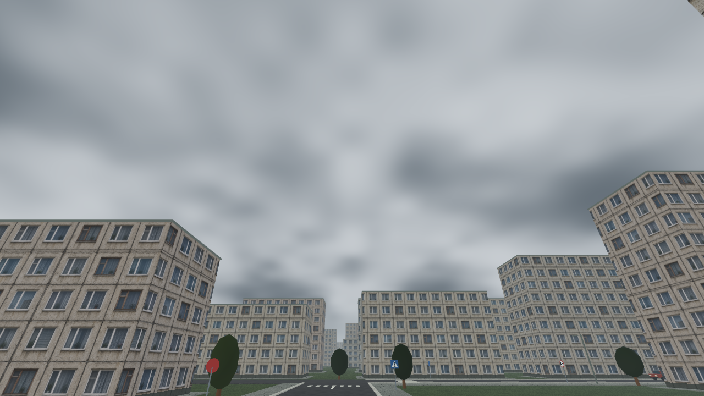
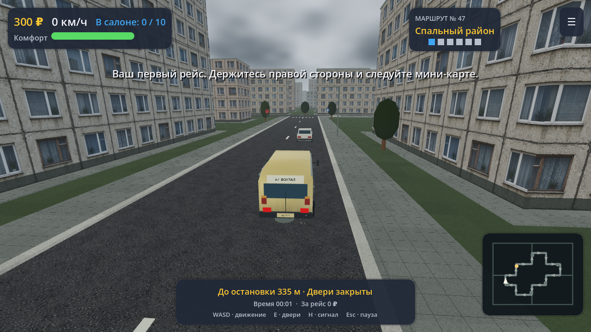
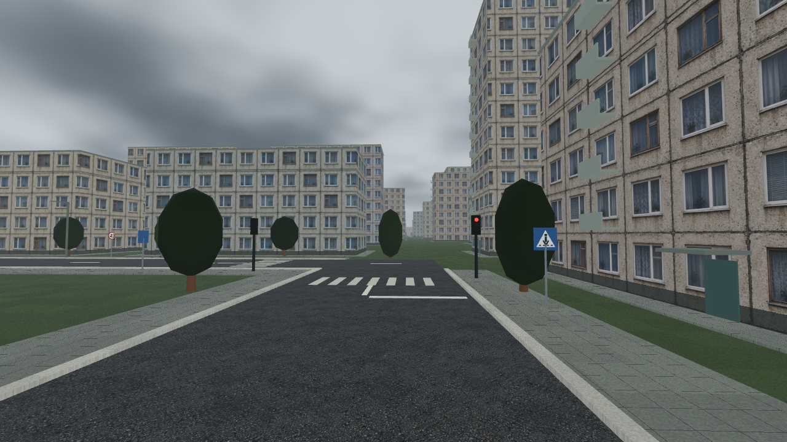

## Расширение города

- Игровая территория увеличена с 860×840 до 1220×1200 м (примерно вдвое по площади).
- 691 дополнительный жилой корпус вместо разреженных одиночных домов: длинные
  панельные секции, второй ряд вдоль улиц и застройка внутренних кварталов.
- Внешняя улица и четыре соединения добавляют 4,12 км дорог; маршрут рейса
  и его шесть остановок сохранены. Новые улицы показаны на мини-карте.
- У домов есть отмостки, подъезды и балконы. Участки резервируются с учётом
  остановок, существующих объектов, дорог и соседних домов.
- Ослаблены свет и дальняя дымка; у текстур включены mipmaps, чтобы
  мелкие детали фасадов и асфальта не рябили на расстоянии.

Повторный прогон: 117 проверок прошли без ошибок, включая непрерывный
проезд ГАЗели и ПАЗика без столкновений с окружением. Дополнительная
проверка новых дорог: 2076 точек на обеих полосах, препятствий нет.
Производительность на физических устройствах ещё не измерена.

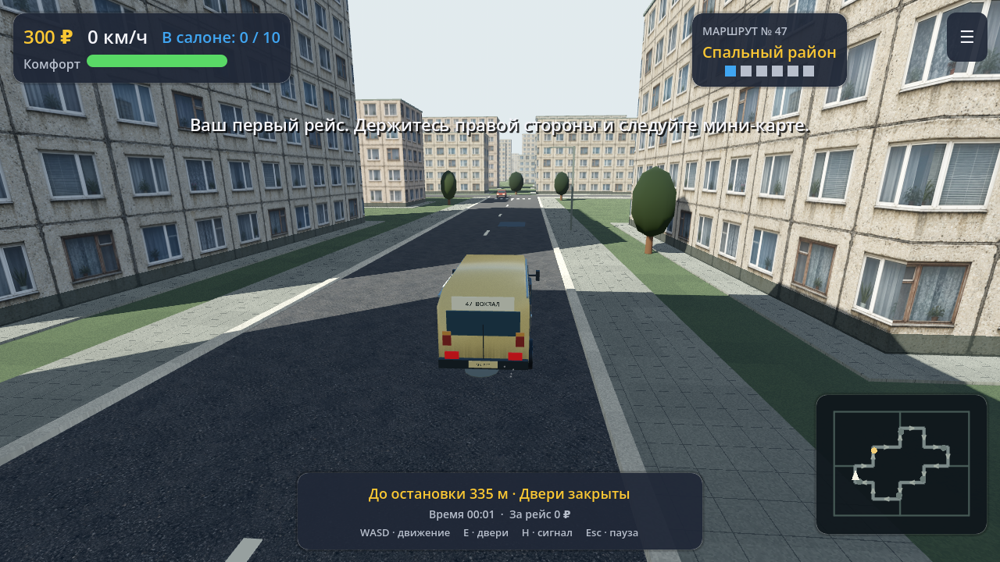
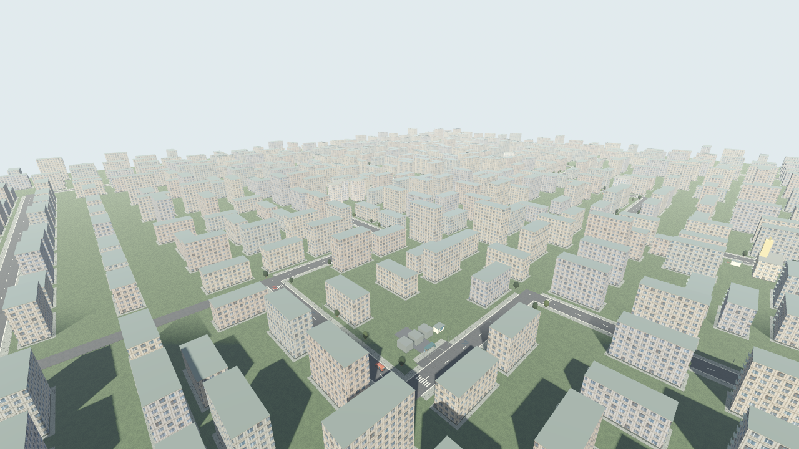

## Что изменилось

- Настоящие растровые текстуры фасадов и асфальта, балконы, подъезды,
  переходы, павильоны, посадочные карманы и очереди на тротуарах.
- Детали ГАЗели и ПАЗика, разные двери, материалы кузова со следами износа.
- Встречные автомобили с коллизиями и движением по своей полосе.
- Камера с проверкой препятствий, постоянные подсказки, направление на карте.
- Радио с оригинальной музыкальной петлёй, двигатель с имитацией передач,
  сигнал, работающие ползунки громкости, настройки из паузы.
- Ожидание посадки и высадки, защита повторного бонуса за сдачу,
  корректное завершение рейса, цель — ПАЗ и три звезды на нём.
- Атомарное сохранение с резервной копией и проверкой загруженных данных.
- Независимые пальцы для газа и руля, сброс ввода при паузе и потере фокуса.

## Проверки

`tests/run_checks.sh` запускает импорт, базовые проверки, оба рейса,
проверки сохранений/паузы/выплат, непрерывное вождение и мультитач.

В предыдущем прогоне этой итерации базовые проверки прошли 30/30;
оба рейса с реальной посадкой завершились; непрерывный водительский тест
провёл обе машины через все шесть остановок без столкновений с окружением.
Проверки сохранений, паузы и выплат: 10/10; сенсорного ввода: 5/5.

Водительский тест подаёт газ, тормоз и руль в обычный контроллер;
после появления машины её позиция не переносится. Случайные события и
встречные автомобили в этом тесте отключены для проверки геометрии пути.
Это автоматизированный проезд, а не ручной плейтест человеком.

Кадры сняты в настоящем OpenGL-рендере Mesa llvmpipe, 1280×720.
`results.png` — проверка раскладки экрана через вызов завершения короткого
тестового заезда, а не иллюстрация результатов полного рейса.
Мобильный кадр показывает сенсорную раскладку в настольном рендере.
Физические телефоны и производительность на них не проверялись.

При завершении тестов Godot сообщает ObjectDB о ресурсах; виртуальный
дисплей предупреждает о VSync. Эти предупреждения не являются результатом
проверки производительности или обещанием FPS.

## Кадры предыдущей итерации

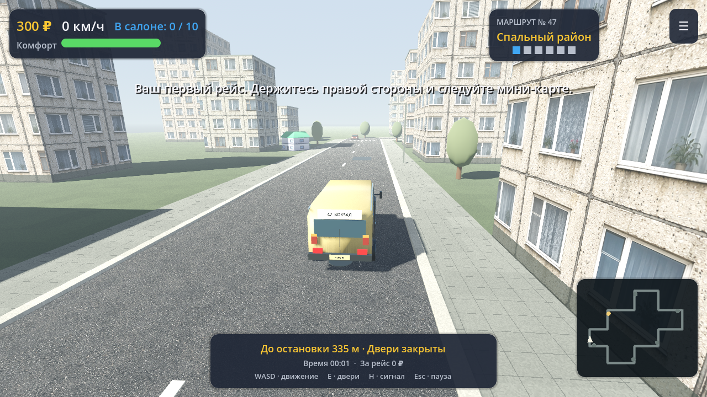
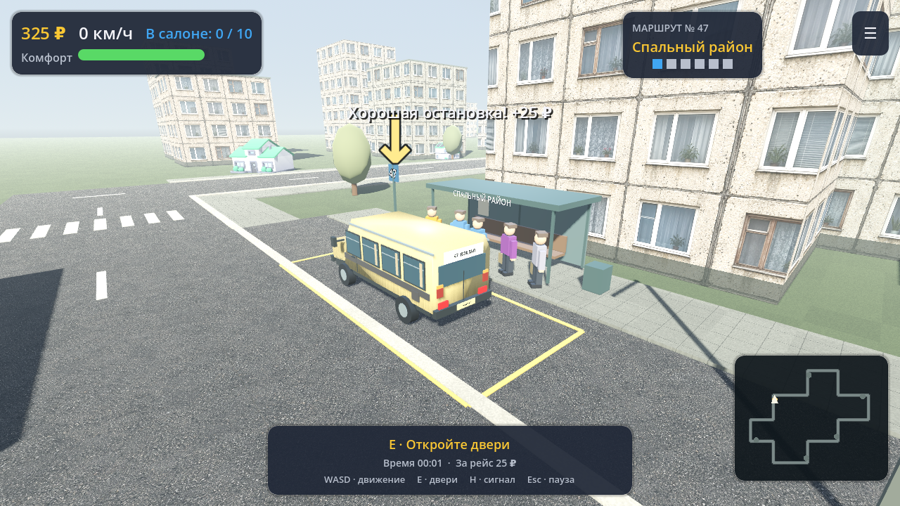
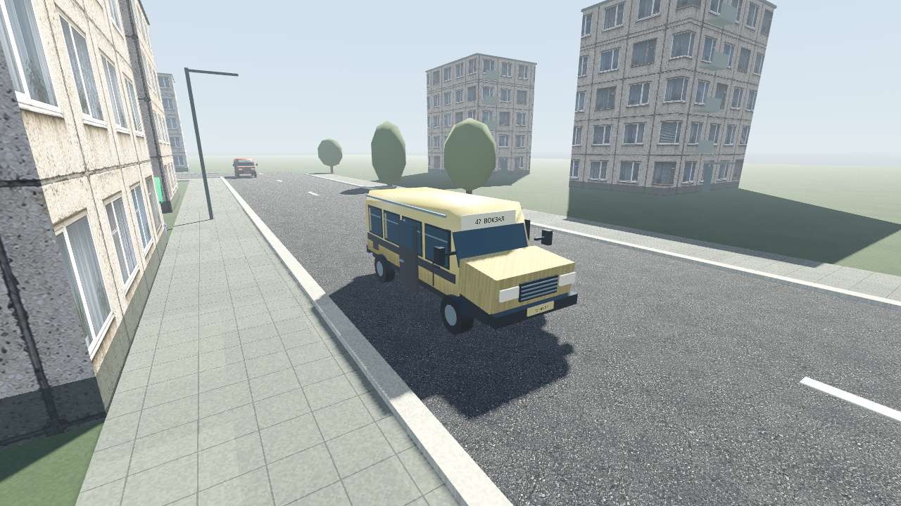
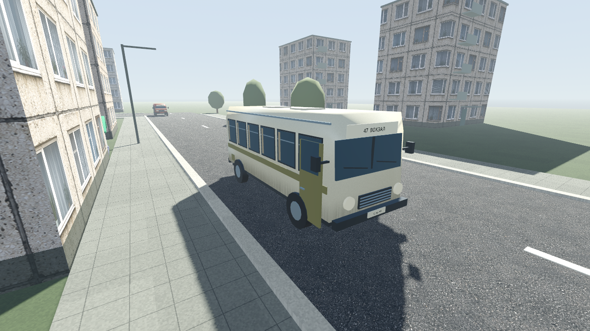
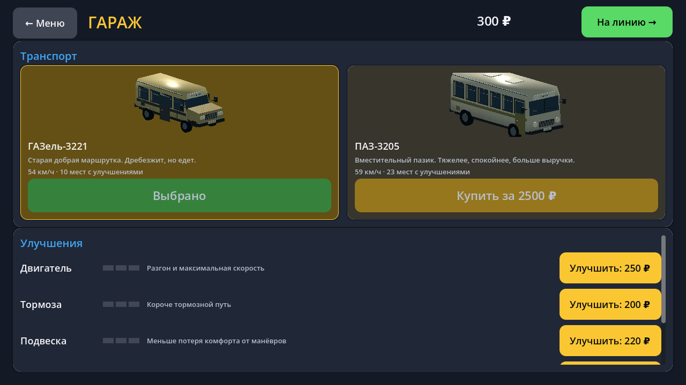
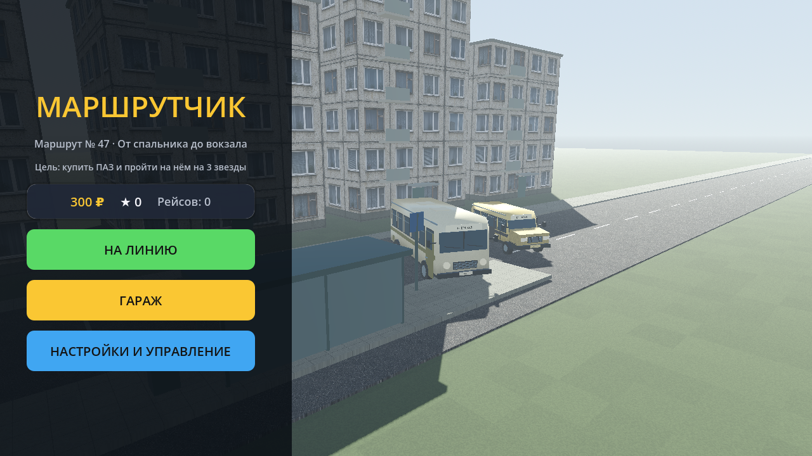
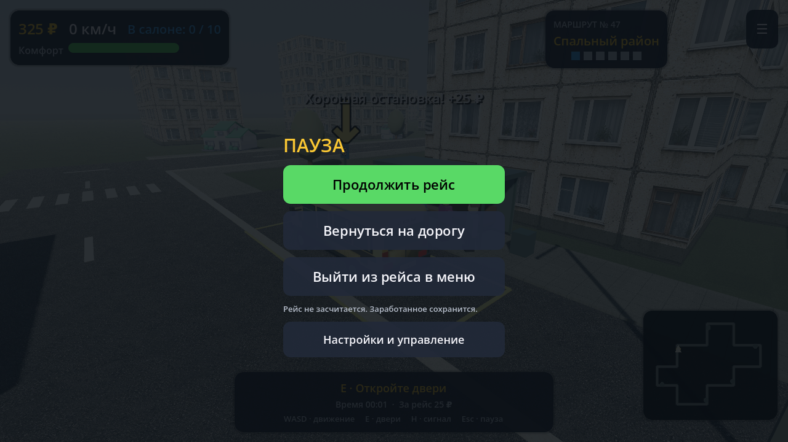
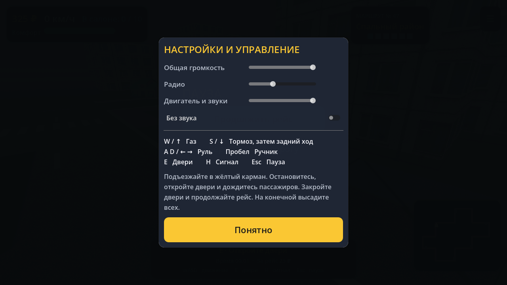
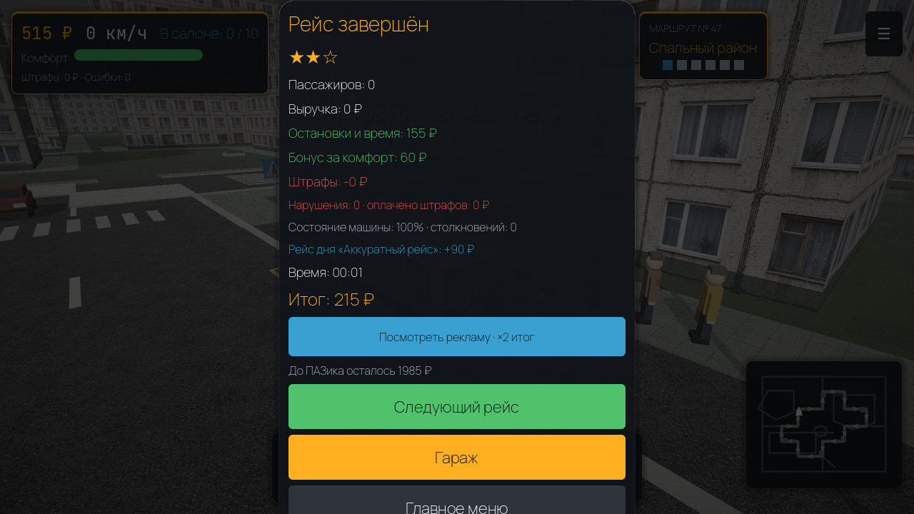
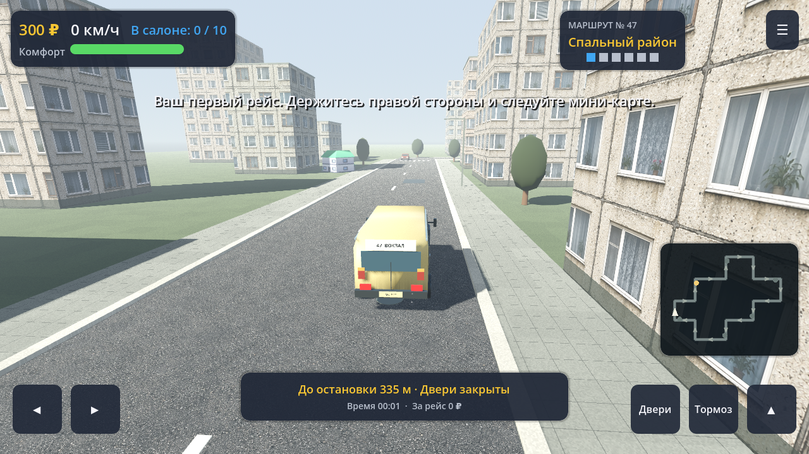
